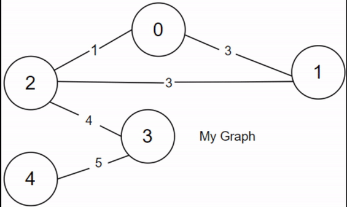
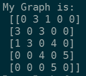
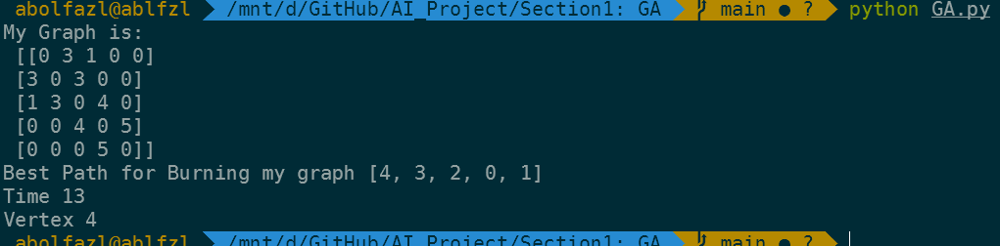

In this Section of project Implemented Genetic Algorithm for solving the Problem. 
this project is related to the <u>[**Burning Graph**](#Burning-Graph-in-Computer-Science)</u> problem.


## How  to Run: 


after inserting the files in your local just run the bellow command

```
python GA.py
```
:)

## Results:


### Input:

A adjacency matrix of a graph with n vertex like this:

>n=5





### Output

- Best path for propagate or burning
- Best Time 
- Number of vetexes
  
  

## About the Project:
> the project contains two files 
> 1. `GA.py` which contains the main code.
> 2. `functions.py` which contains the functions used in the main code.


the `functions.py` contains below functions:

- **First POPulation**: Creating the first population randomly. and then returning it.

- **Fitness**: calculates the time and number of vertices covered based on the input


- **Crossover**: Combining parts of two individuals to create offspring.

- **Mutation**: Introducing random changes to individuals to maintain diversity within the population.


### Burning Graph in Computer Science

The concept of a "Burning Graph" in computer science refers to a problem where we aim to determine the minimum time required to burn all the vertices of a graph, assuming that the graph represents a network or structure catching fire. This is an abstract problem that has practical applications in network security, epidemiology, and understanding the spread of information or diseases through networks.


